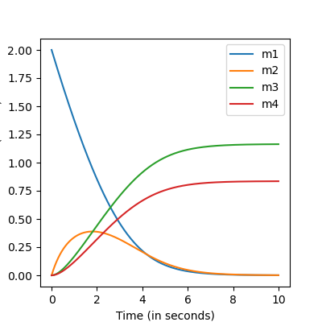

# Building models


## Metabolic kinetic modelling
The time evolution of metabolic states are often described by a set of Ordinary Differential Equations (ODEs)
$$\frac{dm(t)}{dt}=S\cdot v(t,m(t),\theta)$$

\\(S\\) is the stoichiometric matrix that describes the mass balances of a metabolic system. The fluxes \\(v\\) are described by reaction mechanisms, typically of some form like Michaelis-Menten or Hill equations. These mechanisms are parameterized by \\(\theta\\). By providing the initial values of the metabolic states, the ODEs can be solved using a numerical solver
$$m(T)=m(0)+\int_0^T S\cdot v(t,m(t),\theta)dt$$

We will describe below how you can build your own models that are compatible with Jax/Diffrax **[1]**. 


## The `Reaction` object

##### A reaction-centric approach
Models can be built in a reaction-centric manner. The `Reaction` object requires setting five inputs: name of the reaction, stoichiometry of the reaction, compartments of the species involved, and it's mechanism. 

```python
from source.kinetic_mechanisms import JaxKineticMechanisms as jm
from source.building_models import JaxKineticModelBuild as jkm

import jax.numpy as jnp
import jax
import numpy as np
import diffrax 
import matplotlib.pyplot as plt
import pandas as pd


ReactionA=jkm.Reaction(
    name="ReactionA",
    species=['A','B'],
    stoichiometry=[-1,1],
    compartments=['c','c'],
    mechanism=jm.Jax_MM_Irrev_Uni(substrate="A",vmax="A_Vmax",km_substrate="A_Km"),
    )
```
The `mechanism` is another class that describes the flux function, which depends on metabolite states and parameters. Parameters are pointed towards with unique symbols. The reaction object is implemented in a way that own-implemented flux functions can be used. We have also implemented a set of general flux functions that are often used in systems biology. 

##### Table of implemented mechanisms
| **Type of Reaction**             | **Name (in JAX class)**                         | **Number of Parameters**  |
|----------------------------------|-------------------------------------------------|---------------------------|
| A → B                            | Jax_MM_Irrev_Uni                                | 2                         |
| A → B                            | Jax_MM_Irrev_Uni_w_modifiers                    | 2 + modifiers              |
| A ↔ B                            | Jax_MM_Rev_UniUni                               | 4                         |
| A →                              | Jax_MM_Sink                                     | 2                         |
| A →                              | Jax_MA_Irrev                                    | 1                         |
| A ⇒                              | Jax_Facilitated_Diffusion                       | 3                         |
| A ⇒                              | Jax_Diffusion                                  | 2                         |
| A + B → C                        | Jax_MM_Irrev_Bi                                | 3                         |
|                                  | Jax_MM_Irrev_Bi_w_Inhibition                    | 3                         |
|                                  | Jax_MM_Irrev_Bi_w_modifiers                     | 3 + modifiers              |
| A + B ↔ C + D                    | Jax_MM_Rev_BiBi                                | 6                         |
|                                  | Jax_MM_Rev_BiBi_w_Inhibition                    | 7                         |
|                                  | Jax_MM_Rev_BiBi_w_Activation                    | 9                         |
| A + B ↔ C + D                    | Jax_MA_Rev_Bi                                  | 2                         |
| A ↔ B + C                        | Jax_MM_Rev_UniBi                               | 5                         |
| A + B → C + D + E                | Jax_MM_Ordered_BiTri                           | 7                         |
| A + B → C + D                    | Jax_ADH                                        | 15                        |
| A → B + C                        | Jax_Hill_Bi_Irreversible_Activation             | 7                         |
| A → B + C                        | Jax_Hill_Irreversible_Inhibition                | 7                         |

## Building simple models

#### A simple metabolic network example
Here, we show an example of how to build kinetic models using the reaction objects described above. We model the following network:


Three metabolic fluxes need to be modelled
```python


#Add reactions v1 to v3
v1=jkm.Reaction(
    name="v1",
    species=['m1','m2'],
    stoichiometry=[-1,1],
    compartments=['c','c'],
    mechanism=jm.Jax_MM_Irrev_Uni(substrate="m1",vmax="A_Vmax",km_substrate="A_Km"),
    )

v2=jkm.Reaction(
    name="v2",
    species=['m2','m3'],
    stoichiometry=[-1,1],
    compartments=['c','c'],
    mechanism=jm.Jax_MM_Irrev_Uni(substrate="m2",vmax="B_Vmax",km_substrate="B_Km"),
    )

v3=jkm.Reaction(
    name="v3",
    species=['m2','m4'],
    stoichiometry=[-1,1],
    compartments=['c','c'],
    mechanism=jm.Jax_MM_Irrev_Uni(substrate="m2",vmax="C_Vmax",km_substrate="C_Km"),
    )

# initialized the kinetic model object, which is termed NeuralODE. 
reactions=[v1,v2,v3]
compartment_values={'c':1.0,}
kmodel=jkm.NeuralODE(reactions,compartment_values)
print(kmodel.stoichiometric_matrix)
```
The stoichiometric matrix is automatically constructed from the reactions.

         v1   v2   v3
    m1 -1.0  0.0  0.0
    m2  1.0 -1.0 -1.0
    m3  0.0  1.0  0.0
    m4  0.0  0.0  1.0

One can first jax.jit the model **[2]** and solve the ODEs using the diffrax package **[1]**, which contains many nice numerical solvers.

```python
#define the time interval, and the initial conditions
ts=jnp.linspace(0,10,1000)
y0=jnp.array([2,0,0,0])
params=dict(zip(kmodel.parameter_names,jnp.array([1,1,1,1,1.5,1])))

#jit the kmodel object. This results in a slow initial solve, but a c-compiled solve
kmodel=jax.jit(kmodel)
ys=kmodel(ts,y0,params)
ys=pd.DataFrame(ys,columns=kmodel.species_names)

fig,ax=plt.subplots(figsize=(4,4))
ax.plot(ts,ys['m1'],label="m1")
ax.plot(ts,ys['m2'],label="m2")
ax.plot(ts,ys['m3'],label="m3")
ax.plot(ts,ys['m4'],label="m4")
ax.set_xlabel("Time (in seconds)")
ax.set_ylabel("Concentration (in mM)")
ax.legend()
fig.savefig("docs/docs/images/timeseries_example.png")
```



#### On jit-compiling kinetic models
When you simulated a jit-compiled kinetic model for a certain time-range (e.g., `jnp.linspace(0,10,1000)` and you want to elongate this, it is best to not change the number of timepoints (e.g, `jnp.linspace(0,1000,1000)`. Otherwise, the kinetic models needs to be recompiled.  
## Boundary conditions
#### Constant boundary conditions

#### Non-constant boundary conditions

## Saving models


## References
[1] Kidger, P. (2022). On neural differential equations. arXiv preprint arXiv:2202.02435.
[2] Bradbury, J., Frostig, R., Hawkins, P., Johnson, M. J., Leary, C., Maclaurin, D., ... & Zhang, Q. (2018). JAX: composable transformations of Python+ NumPy programs.


