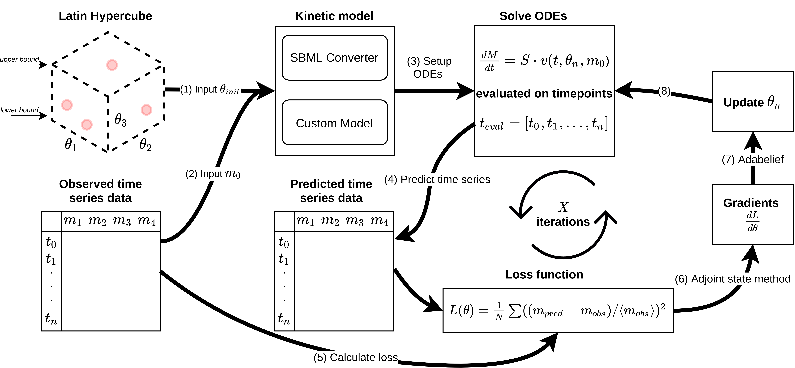
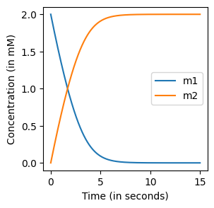

# Summary

## Introduction
A package for building, simulating and training kinetic models using Jax/Diffrax.



<span style="font-size: 0.8em;"><b>Figure 1:</b> Overview of the training procedure of SBML models being parameterized using techniques from neural differential equations .</span>
## Installation

Alternatively, the ``jaxkineticmodel`` package can be installed using 
`pip` by cloning the repository and from the project folder doing:
```
git clone https://github.com/AbeelLab/jaxkineticmodel.git
python -m pip install .
```

We will make the package `pip`-installable before publication.

## Minimal simulation example
```python 
{!code/minimal_example.py!}
```


<span style="font-size: 0.8em;"><b>Figure 2:</b> Simple reaction system simulation.</span>


## References
[^1]: van Lent, P., Bunkova, O., Planken, L., Schmitz, J., & Abeel, T. (2024). Neural Ordinary Differential 
Equations Inspired Parameterization of Kinetic Models. bioRxiv, 2024-12.

